# BIS 305 Assignment 6B - Case Problem 7-1.

This repo is for use to code and debug the BIS 305 Assignment 5 - Case Problem 1.

### Use Case 1

The inputs in the console should be:
```html
Enter number of contestants last year >> 2
Enter number of contestants this year >> 3
```

The output from the console should be:
```html
Last year's competition had 2 contestants, and this year's has 3 contestants
Revenue expected this year is $75.00
The competition is bigger than ever!
Enter contestant name >>
```

The inputs in the console should then be:
```html
Enter contestant name >> Jill
```

The output from the console should be:
```html
Talent codes are:
  S   Singing
  D   Dancing
  M   Musical instrument
  O   Other
       Enter talent code >> 
```
The inputs in the console should then be:
```html
       Enter talent code >> S
```

The output from the console should be:
```html
Enter contestant name >> 
```

The inputs in the console should then be:
```html
Enter contestant name >> Mikia
```

The output from the console should be:
```html
Talent codes are:
  S   Singing
  D   Dancing
  M   Musical instrument
  O   Other
       Enter talent code >> 
```
The inputs in the console should then be:
```html
       Enter talent code >> M
```

The output from the console should be:
```html
Enter contestant name >> 
```

The inputs in the console should then be:
```html
Enter contestant name >> Sarah
```

The output from the console should be:
```html
Talent codes are:
  S   Singing
  D   Dancing
  M   Musical instrument
  O   Other
       Enter talent code >> 
```
The inputs in the console should then be:
```html
       Enter talent code >> D
```

The output from the console should be
```
The types of talent are:
Singing                   1
Dancing                   1
Musical instrument        1
Other                     0

Enter a talent type or Z to quit >> 
```
The inputs in the console should then be:
```html
Enter a talent type or Z to quit >> Z
```
And this should close the console application.

### Here is a flowchart for the logic:  

```mermaid
flowchart TB
A["Display  #quot;Enter number of contestants last year >>  #quot;\n in the console"] --> B[Get input from the user.];
B --> C{Is last year's entry less than 0 or more than 30?};
C --> |Yes| D["Display  #quot;Number must be between 0 and 30\nEnter number of contestants last year >> #quot; "];
D --> B
C --> |No| E["Display  #quot;Enter number of contestants this year >> #quot;\n in the console"] --> F[Get input from the user.];
F --> G{Is this year's entry less than 0 or more than 30?};
G --> |Yes| H["Display  #quot;Number must be between 0 and 30\nEnter number of contestants this year >> #quot; "];
H --> F
G --> |No| I["Display  #quot;Last year's competition had {LastYearEntry} contestants,\n and this year's has {ThisYearEntry} contestants #quot;\n in the console"];
I --> J{Is this year's entry more than\n twice as many contestants as last year?};
J --> |Yes| K["Display  #quot;The competition is more than twice as big this year! #quot; "];
J --> |No| L{Is this year's entry is more than\n contestants than last year,\n but not more than twice as big?};
L --> |Yes| M["Display  #quot;The competition is bigger than ever! #quot;"];
L --> |No| N{Is this year's entry\n smaller than last year's?};
N --> |Yes| O["Display  #quot;A tighter race this year! Come out and cast your vote! #quot;"];
K --> P["Display  #quot;Enter contestant name >>  #quot;"];
M --> P["Display  #quot;Enter contestant name >>  #quot;"];
O --> P["Display  #quot;Enter contestant name >>  #quot;"];
P --> Q[Get input from the user.];
Q --> R["Display  <br>#quot;Talent codes are:<br>&nbsp;&nbsp;S&nbsp;&nbsp;&nbsp;Singing<br>&nbsp;&nbsp;D&nbsp;&nbsp;&nbsp;Dancing<br>&nbsp;&nbsp;M&nbsp;&nbsp;&nbsp;Musical instrument<br>&nbsp;&nbsp;O&nbsp;&nbsp;&nbsp;Other<br>&nbsp;&nbsp;&nbsp;&nbsp;&nbsp;&nbsp;Enter talent code >> #quot;"];
R --> S[Get input from the user.];
S --> T["Display  #quot;&nbsp;&nbsp;&nbsp;&nbsp;&nbsp;&nbsp;Enter talent code >>#quot;"];
T --> U[Get input from the user.];
U -->|For each of this year's contestants|P
U -->|Per the entries in the example above| V["Display  #quot;The types of talent are:<br>Singing&nbsp;&nbsp;&nbsp;&nbsp;&nbsp;&nbsp;1<br>Dancing&nbsp;&nbsp;&nbsp;&nbsp;&nbsp;1<br>
Musical instrument&nbsp;&nbsp;&nbsp;&nbsp;&nbsp;1<br>Other&nbsp;&nbsp;&nbsp;&nbsp;&nbsp;0<br><br>Enter a talent type or Z to quit >> #quot;"];
V --> W["The user enters #quot;Z#quot;"];
W --> X["The console closes with the<br>stop of the program."];
```

<!-- below from https://github.com/mermaid-js/mermaid -->

